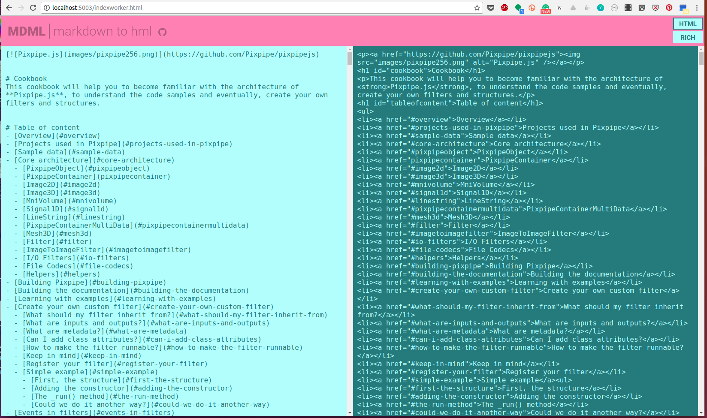

# MDML
A markdown editor that focuses on outputing HTML text that you can copy/paste into a HTML document. You can also render as rich text, but this is not really interesting.  

The motivation behind this tool is that I found myself having to type HTML too often and typing HTML with all the markups is kind of annoying.  

MDML translates Markdown to HTML while typing and is optimized for large text so that the typing is not interrupted by the translating due to performance issues.  
This is achieved using:
- a parallel web worker that translates the text in a background task
- an adaptative translating frequency that depends on the time necessary to convert the text (this avoids overloading the CPU by translating every character typed when text is a few thousands lines)
- the assumption that the users will start to care about having a refreshed translation only a few millisec after typing (and not during typing)

[TRY IT](http://me.jonathanlurie.fr/mdml/)

